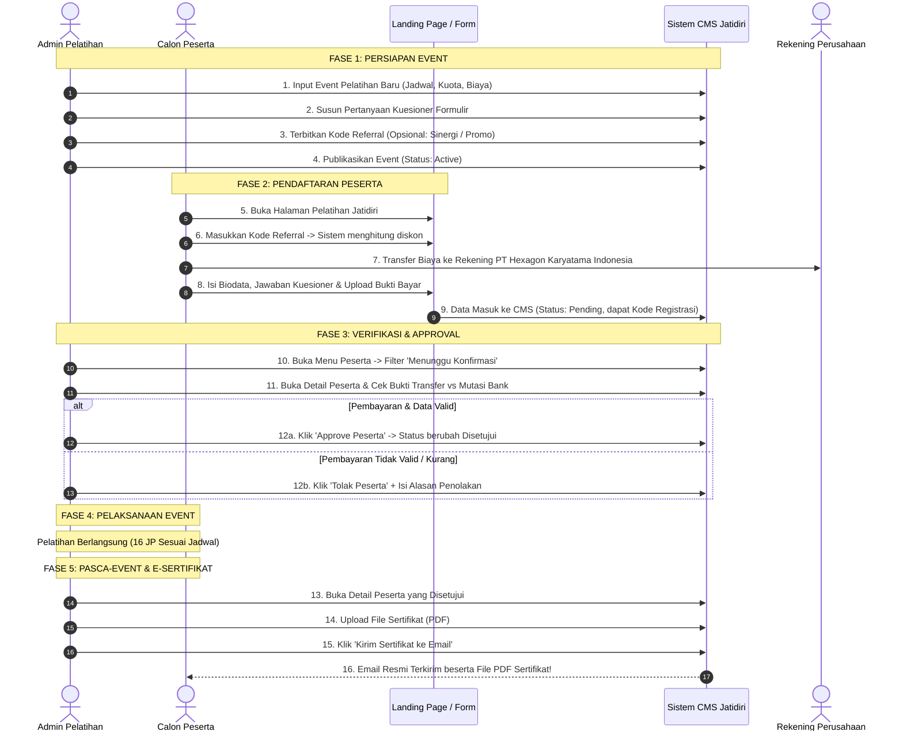

# BUKU PANDUAN PENGELOLA PELATIHAN (ADMIN MANUAL BOOK & SOP)
**Sistem Informasi & Manajemen Pelatihan — Jatidiri**

---

## DAFTAR ISI

1. [BAB I: PENDAHULUAN & RUANG LINGKUP](#bab-i-pendahuluan--ruang-lingkup)
   - 1.1 Latar Belakang & Tujuan
   - 1.2 Peran & Tanggung Jawab Admin
   - 1.3 Akses Masuk Panel Admin
2. [BAB II: STRUKTUR FITUR & FUNGSINYA](#bab-ii-struktur-fitur--fungsinya)
   - 2.1 Manajemen Event Pelatihan
   - 2.2 Dynamic Form Builder (Pertanyaan Kuesioner Fleksibel)
   - 2.3 Manajemen Kode Referral & Potongan Harga
   - 2.4 Manajemen & Filter Peserta Pendaftar
   - 2.5 Verifikasi Pembayaran & Bukti Transfer
   - 2.6 Sistem Approval & Rejection Peserta
   - 2.7 Manajemen Upload & Pengiriman E-Sertifikat via Email
3. [BAB III: ALUR KERJA OPERASIONAL LENGKAP (END-TO-END WORKFLOW)](#bab-iii-alur-kerja-operasional-lengkap-end-to-end-workflow)
   - 3.1 Diagram Alur Kerja (SOP Flowchart)
   - 3.2 Penjelasan Tiap Fase Kegiatan
4. [BAB IV: PANDUAN PRAKTIS LANGKAH DEMI LANGKAH (STEP-BY-STEP SOP)](#bab-iv-panduan-praktis-langkah-demi-langkah-step-by-step-sop)
   - 4.1 Cara Membuat Event Pelatihan Baru
   - 4.2 Cara Mengatur Pertanyaan Kuesioner Formulir
   - 4.3 Cara Membuat & Mengelola Kode Referral
   - 4.4 Cara Memeriksa Data & Bukti Bayar Peserta
   - 4.5 Cara Menyetujui (Approve) Pendaftaran Peserta
   - 4.6 Cara Menolak (Reject) Pendaftaran Peserta
   - 4.7 Cara Mengunggah File Sertifikat Peserta
   - 4.8 Cara Mengirimkan E-Sertifikat ke Email Peserta
5. [BAB V: STANDAR & KETENTUAN OPERASIONAL ADMIN](#bab-v-standar--ketentuan-operasional-admin)
   - 5.1 Standar File Sertifikat
   - 5.2 Standar Verifikasi Pembayaran & Kuitansi (Invoice)
   - 5.3 Komunikasi Resmi Peserta via WhatsApp
6. [BAB VI: TROUBLESHOOTING & PERTANYAAN UMUM (FAQ)](#bab-vi-troubleshooting--pertanyaan-umum-faq)

---

## BAB I: PENDAHULUAN & RUANG LINGKUP

### 1.1 Latar Belakang & Tujuan
Modul Pelatihan pada CMS Jatidiri dirancang untuk menggantikan proses manual pendaftaran pelatihan (seperti Google Formulir yang terpisah dari pencatatan keuangan) menjadi satu kesatuan sistem digital yang terpusat, rapi, dan otomatis.

Melalui sistem ini, Admin dapat:
- Membuat dan mempublikasikan event pelatihan dalam hitungan menit.
- Menyesuaikan form pendaftaran secara dinamis sesuai kebutuhan tema pelatihan.
- Menerbitkan kode promosi/referral dengan diskon nominal maupun persentase.
- Memverifikasi pembayaran peserta dan melakukan approval.
- Mengirimkan sertifikat resmi langsung ke email peserta tanpa perlu mengirim satu per satu secara manual melalui email klien eksternal.

### 1.2 Peran & Tanggung Jawab Admin
| Peran | Tanggung Jawab |
|---|---|
| **Admin Pelatihan / Event Manager** | Menginput informasi acara, jadwal, kuota, biaya, menyusun pertanyaan kuesioner, dan membuat kode referral. |
| **Finance / Verifikator Pembayaran** | Memeriksa mutasi rekening bank berdasarkan bukti transfer yang diunggah peserta, lalu melakukan *Approve* atau *Reject*. |
| **Admin Sertifikat / Logistik** | Mengunggah file PDF sertifikat yang telah diterbitkan dan menekan tombol kirim email sertifikat setelah kegiatan selesai. |

### 1.3 Akses Masuk Panel Admin
1. Buka browser (Google Chrome, Microsoft Edge, dll).
2. Akses halaman login admin: `http://<domain-website>/login`
3. Masukkan username/email dan password admin resmi.
4. Pada navigasi sidebar sebelah kiri, klik menu **Pelatihan**.

---

## BAB II: STRUKTUR FITUR & FUNGSINYA

Sistem Pelatihan Jatidiri memiliki 7 fitur inti yang saling terhubung:

```
[ PANEL ADMIN PELATIHAN ]
   │
   ├── 1. Master Event Pelatihan (Judul, Biaya, Jadwal, Kuota, Rekening)
   ├── 2. Form Builder Kuesioner (Pertanyaan Dinamis: Teks, Pilihan, Checkbox, dll)
   ├── 3. Referral & Diskon (Kode Promo, Potongan Rp / %, Limit Kuota)
   ├── 4. Monitoring Pendaftar (Tabel Peserta, Filter Status, Search)
   ├── 5. Verifikasi Keuangan (Pemeriksaan Bukti Transfer & Invoice)
   ├── 6. Approval Engine (Setujui / Tolak Pendaftar + Catatan Khusus)
   └── 7. E-Sertifikat (Upload PDF & Otomatisasi Kirim Email Lampiran)
```

---

### 2.1 Manajemen Event Pelatihan
- **Fungsi**: Pusat pendataan setiap program pelatihan yang diselenggarakan oleh Jatidiri.
- **Data yang Dikelola**:
  - **Judul Pelatihan & Batch**: Identitas kegiatan (misal: *Pelatihan Peer Counselor: Active Listening - Batch 3*).
  - **Deskripsi & Materi**: Rincian isi program, fasilitator/narasumber, dan fasilitas yang didapatkan peserta.
  - **Jadwal & Waktu**: Tanggal mulai, tanggal selesai, serta jam sesi (misal: *08.00 - 16.00 WIB*).
  - **Lokasi**: Lokasi fisik (kantor/hotel) atau tautan ruang pertemuan online (Zoom/GMeet).
  - **Biaya & Rekening**: Harga normal per peserta, nama bank tujuan, nomor rekening resmi, dan atas nama rekening.
  - **Kuota & Kontak**: Batas jumlah peserta maksimal, nomor WhatsApp admin pelayanan, dan email bantuan.
  - **Status Event**:
    - `Draft`: Masih disiapkan, belum tampil di halaman publik/landing page.
    - `Active`: Pendaftaran resmi dibuka untuk umum.
    - `Closed`: Pendaftaran ditutup (kuota penuh atau waktu habis).

---

### 2.2 Dynamic Form Builder (Pertanyaan Kuesioner Fleksibel)
- **Fungsi**: Mengatur formulir pendaftaran secara fleksibel untuk setiap event tanpa perlu bantuan tim programmer untuk mengubah kodingan.
- **Tipe Pertanyaan yang Didukung**:
  1. `Teks Pendek (text)`: Untuk input nama, instansi, jabatan, dll.
  2. `Paragraf (textarea)`: Untuk harapan pelatihan, latar belakang kasus, atau catatan panjang.
  3. `Pilihan Ganda (radio)`: Peserta hanya dapat memilih tepat 1 opsi (misal: Komitmen kehadiran *Ya / Tidak*).
  4. `Dropdown (select)`: Pilihan menu tarik-turun (misal: Jenjang Lembaga: *PAUD, SD, SMP, SMA, PT*).
  5. `Kotak Centang (checkbox)`: Peserta dapat memilih lebih dari satu opsi.
  6. `Angka (number)`: Untuk jumlah peserta kolektif, tahun pengalaman, dll.
- **Pengaturan Wajib/Opsional**: Setiap butir pertanyaan dapat disetel apakah wajib diisi (*Required*) atau boleh dikosongkan.

---

### 2.3 Manajemen Kode Referral & Potongan Harga
- **Fungsi**: Mengakomodasi kerja sama kemitraan, alumni, member khusus (seperti *Member Sinergi Project*), atau program promo terbatas (*Early Bird*).
- **Jenis Pemotongan Harga**:
  - **Nominal Tetap (Rp)**: Contoh voucher potongan langsung Rp 50.000 atau Rp 100.000.
  - **Persentase (%)**: Contoh potongan 10% atau 20% dari harga normal.
- **Fitur Batasan (Limit Kuota)**:
  - Admin dapat membatasi berapa kali suatu kode referral boleh digunakan (misal: hanya untuk 50 pendaftar pertama).
  - Sistem otomatis mencatat jumlah pemakaian (`used_count`) secara riil ketika pendaftar disetujui (*Approved*).
  - Kode referral dapat dinonaktifkan sewaktu-waktu dengan menonaktifkan centang status.

---

### 2.4 Manajemen & Filter Peserta Pendaftar
- **Fungsi**: Dasbor rekapitulasi seluruh calon peserta yang mendaftar melalui landing page.
- **Fitur Utama**:
  - **Tab Filter Cepat**:
    - `Semua`: Menampilkan seluruh riwayat pendaftar.
    - `Menunggu Konfirmasi (Pending)`: Calon peserta yang baru mendaftar dan menunggu verifikasi admin (badge kuning).
    - `Disetujui (Approved)`: Peserta yang sudah valid pembayarannya dan terkonfirmasi kursi pelatihannya (badge hijau).
    - `Ditolak (Rejected)`: Pendaftar yang dibatalkan karena tidak valid/tidak transfer (badge merah).
  - **Pencarian Cerdas**: Mencari data secara instan berdasarkan Nama Lengkap, Kode Registrasi, Email, atau Nomor WhatsApp.
  - **Data Kolektif vs Individu**: Membedakan pendaftaran perorangan dan delegasi sekolah/instansi beserta nama koordinator lembaganya.

---

### 2.5 Verifikasi Pembayaran & Bukti Transfer
- **Fungsi**: Memastikan setiap rupiah yang masuk ke rekening perusahaan sesuai dengan tagihan peserta.
- **Rincian yang Ditampilkan**:
  - Harga Asli Pelatihan.
  - Besaran Potongan Diskon (jika memakai kode referral).
  - **Total Tagihan Akhir** yang wajib dibayar.
  - Nama Pengirim Rekening Peserta & Tanggal Transfer.
  - File Bukti Transfer (dapat dilihat/dibuka langsung dengan 1 klik).
  - Keterangan Kebutuhan Kuitansi / Invoice (beserta nama instansi yang harus dicantumkan di kuitansi).

---

### 2.6 Sistem Approval & Rejection Peserta
- **Fungsi**: Menentukan kepastian kursi peserta secara resmi.
- **Tombol Approve**:
  - Mengubah status pendaftar menjadi **Disetujui**.
  - Menambah hitungan penggunaan kode referral terkait.
  - Membuka akses untuk pengunggahan sertifikat.
- **Tombol Reject**:
  - Mengubah status pendaftar menjadi **Ditolak**.
  - Menyediakan kolom catatan penolakan (*admin note*) untuk arsip internal (misal: "Bukti transfer buram/tidak terbaca" atau "Transfer kurang nominal").

---

### 2.7 Manajemen Upload & Pengiriman E-Sertifikat via Email
- **Fungsi**: Mengirimkan dokumen sertifikat kelulusan/keikutsertaan berformat PDF langsung ke inbox email peserta secara personal.
- **Mekanisme**:
  1. Admin mengunggah file PDF sertifikat resmi yang sudah jadi (disiapkan desainer/admin).
  2. Sistem menyimpan file secara aman dan menampilkan status *File Tersedia*.
  3. Admin cukup mengklik tombol **Kirim Sertifikat ke Email**.
  4. Sistem mengirim email resmi Jatidiri dengan lampiran sertifikat yang otomatis diberi nama:
     `Sertifikat_<Nama_Lengkap_Peserta>.pdf`.
  5. Sistem merekam tanggal dan jam tepat saat email berhasil dikirim.
  6. Tersedia tombol **Kirim Ulang Sertifikat** jika peserta meminta pengiriman kembali.

---

## BAB III: ALUR KERJA OPERASIONAL LENGKAP (END-TO-END WORKFLOW)

### 3.1 Diagram Alur Kerja (SOP Flowchart)



---

## BAB IV: PANDUAN PRAKTIS LANGKAH DEMI LANGKAH (STEP-BY-STEP SOP)

### 4.1 Cara Membuat Event Pelatihan Baru
1. Masuk ke panel admin, pada sidebar klik menu **Pelatihan**.
2. Klik tombol **Tambah Pelatihan** berwarna biru di pojok kanan atas.
3. Lengkapi formulir informasi pelatihan:
   - **Judul Pelatihan**: Masukkan nama lengkap event (misal: *Pelatihan Peer Counselor: Active Listening*).
   - **Batch**: Masukkan batch kegiatan (misal: *Batch 3*).
   - **Biaya (Rp)**: Masukkan angka saja tanpa titik/koma (misal: `750000`).
   - **Mulai & Selesai Tanggal**: Pilih tanggal acara dari pemilih kalender.
   - **Mulai & Selesai Jam**: Masukkan rentang jam acara (misal: `08:00` s/d `16:00`).
   - **Lokasi Pelatihan**: Masukkan alamat jelas gedung/kantor atau link pertemuan daring.
   - **Rekening Pembayaran**:
     - *Nama Bank*: Contoh `Bank Mandiri`
     - *Nomor Rekening*: Contoh `1320529111818`
     - *Atas Nama*: Contoh `PT Hexagon Karyatama Indonesia`
   - **Kuota Peserta**: Masukkan angka batas maksimal peserta (misal: `30`).
   - **Kontak WhatsApp & Email**: Masukkan kontak resmi admin piket untuk melayani pertanyaan peserta.
   - **Banner/Gambar**: Unggah poster kegiatan (disarankan format JPG/PNG/WebP, maksimal 2 MB).
   - **Status Pelatihan**: Pilih `Active` agar pendaftaran langsung terbuka di web.
4. Lanjutkan ke langkah 4.2 jika ingin menambahkan pertanyaan kuesioner, lalu klik **Simpan Data Pelatihan**.

---

### 4.2 Cara Mengatur Pertanyaan Kuesioner Formulir
Pada halaman yang sama (Tambah/Edit Pelatihan):
1. Gulir ke bawah hingga bagian **Pertanyaan Formulir Pendaftaran**.
2. Klik tombol **+ Tambah Pertanyaan**.
3. Sebuah baris pertanyaan baru akan muncul:
   - **Teks Pertanyaan**: Ketik bunyi pertanyaan yang ingin diajukan kepada calon peserta.
   - **Tipe Input**:
     - Pilih `Teks Singkat` untuk isian pendek.
     - Pilih `Paragraf` untuk jawaban panjang/esai.
     - Pilih `Pilihan Ganda (Radio)` jika peserta hanya boleh memilih satu.
     - Pilih `Dropdown (Select)` untuk daftar pilihan tarik-turun.
     - Pilih `Kotak Centang (Checkbox)` jika peserta boleh memilih beberapa opsi.
   - **Opsi Jawaban**: Jika Anda memilih tipe Radio, Select, atau Checkbox, kotak teks opsi akan aktif. **Tuliskan satu pilihan per baris**.
     > *Contoh penulisan opsi:*
     > ```
     > Ya, saya berkomitmen hadir penuh
     > Tidak bisa hadir penuh
     > ```
   - **Wajib Diisi**: Centang kotak jika calon peserta tidak boleh mengosongkan pertanyaan ini.
4. Ulangi klik **+ Tambah Pertanyaan** untuk menambah pertanyaan lainnya.
5. Jika ada pertanyaan yang salah, klik tombol **Hapus** berwarna merah di sisi kanan baris tersebut.
6. Klik **Simpan Data Pelatihan**.

---

### 4.3 Cara Membuat & Mengelola Kode Referral
Kode referral digunakan untuk mitra atau peserta jalur khusus yang berhak menerima diskon pendaftaran.
1. Pada tabel daftar pelatihan, cari event yang dituju.
2. Klik tombol **Referral** pada baris event tersebut.
3. Klik tombol **Tambah Referral**.
4. Isi rincian referral:
   - **Kode Referral**: Masukkan kode menggunakan huruf kapital tanpa spasi (contoh: `SINERGI26` atau `GURUBK2026`).
   - **Nama Mitra / Pemilik**: Masukkan keterangan siapa pemilik/tujuan kode ini (contoh: *Member Sinergi Project* atau *Alumni Batch 2*).
   - **Tipe Diskon**:
     - Pilih `Nominal Tetap (Rp)` jika potongan berupa uang pasti (misal: potongan Rp 50.000).
     - Pilih `Persentase (%)` jika potongan berupa diskon persen (misal: potongan 10%).
   - **Nilai Diskon**: Masukkan angka potongannya:
     - Jika tipe nominal: masukkan `50000` (untuk diskon Rp 50.000).
     - Jika tipe persen: masukkan `10` (untuk diskon 10%).
   - **Batas Kuota Penggunaan**: Tentukan berapa orang maksimal yang boleh memakai kode ini (misal: `100`). Kosongkan jika tidak ada batasan kuota.
   - **Status Aktif**: Pastikan tercentang aktif.
5. Klik **Simpan Referral**.

---

### 4.4 Cara Memeriksa Data & Bukti Bayar Peserta
Setiap kali ada peserta baru yang mendaftar dari website, data akan masuk ke daftar peserta.
1. Pada menu Pelatihan, klik tombol **Peserta** pada baris event yang bersangkutan.
2. Anda akan melihat kartu ringkasan jumlah pendaftar:
   - *Total Pendaftar*, *Menunggu Konfirmasi*, *Disetujui*, dan *Ditolak*.
3. Klik tab filter **Menunggu Konfirmasi** untuk melihat calon peserta yang butuh tindakan verifikasi.
4. Klik tombol **Lihat Detail** pada salah satu baris peserta:
   - **Identitas**: Periksa nama lengkap, ejaan nama untuk sertifikat, WhatsApp, email, dan instansi.
   - **Rincian Keuangan**:
     - Cek apakah peserta memakai referral.
     - Perhatikan baris **Total Bayar** (nominal akhir yang seharusnya ditransfer).
     - Periksa nama pengirim dan tanggal bayar yang diinput peserta.
   - **Bukti Pembayaran**: Klik tombol **Lihat Bukti Pembayaran**. File foto/PDF struk transfer bank akan terbuka di tab baru.
   - **Jawaban Kuesioner**: Periksa jawaban peserta atas pertanyaan formulir.

---

### 4.5 Cara Menyetujui (Approve) Pendaftaran Peserta
Lakukan langkah ini setelah Admin Keuangan memastikan dana transfer **sudah benar-benar masuk** ke mutasi rekening bank perusahaan:
1. Pada halaman **Detail Peserta**, lihat kotak panel sebelah kanan bertuliskan **Approval Peserta**.
2. Masukkan catatan pada kolom *Catatan (opsional)* jika diperlukan (misal: "Lunas via Mandiri 25/09/2026").
3. Klik tombol hijau **Approve Peserta**.
4. Sistem akan:
   - Mengubah status pendaftar menjadi badge hijau **Disetujui**.
   - Menambahkan kuota terpakai pada kode referral yang digunakan peserta tersebut.
   - Memunculkan panel unggah sertifikat.

---

### 4.6 Cara Menolak (Reject) Pendaftaran Peserta
Lakukan langkah ini jika calon peserta mengunggah bukti palsu, salah transfer nominal tanpa konfirmasi lanjutan, atau pendaftaran dibatalkan:
1. Pada halaman **Detail Peserta**, lihat kotak panel sebelah kanan.
2. Pada bagian bawah form persetujuan, terdapat form penolakan.
3. **Wajib isi kolom alasan penolakan** (contoh: *"Bukti transfer tidak terbaca, silakan hubungi admin WhatsApp untuk verifikasi ulang"* atau *"Dana belum masuk ke rekening perusahaan"*).
4. Klik tombol merah **Tolak Peserta**.
5. Status peserta akan berubah menjadi badge merah **Ditolak**.

---

### 4.7 Cara Mengunggah File Sertifikat Peserta
Setelah pelatihan selesai dilaksanakan dan tim sertifikat telah mencetak e-sertifikat resmi dalam format PDF/gambar:
1. Masuk ke menu **Peserta** pada pelatihan terkait.
2. Filter tab **Disetujui**.
3. Klik tombol **Lihat Detail** pada peserta yang bersangkutan.
4. Pada panel sebelah kanan di bagian **Sertifikat**:
   - Klik area kotak unggah file (*Dropify*) untuk memilih file sertifikat dari komputer.
   - Pastikan nama pada file sertifikat sudah sesuai dengan nama pada bagian *Nama Sertifikat* peserta.
   - Format file yang diizinkan: **PDF**, **JPG**, atau **PNG** (Maksimal 5 MB).
5. Klik tombol **Simpan Sertifikat**.
6. Halaman akan memuat ulang dan menampilkan label hijau: **File Tersedia**.

---

### 4.8 Cara Mengirimkan E-Sertifikat ke Email Peserta
Setelah file sertifikat berhasil diunggah:
1. Pada panel **Sertifikat** di halaman detail peserta yang sama, tombol biru **Kirim Sertifikat ke Email** akan muncul.
2. Klik tombol **Kirim Sertifikat ke Email**.
3. Sistem secara otomatis akan:
   - Menyusun email resmi berkop Jatidiri kepada alamat email peserta.
   - Melampirkan file sertifikat sebagai attachment PDF resmi dengan nama rapi: `Sertifikat_<Nama_Peserta>.pdf`.
   - Menampilkan notifikasi sukses berwarna hijau di layar admin: *"Sertifikat berhasil dikirim ke [email peserta]"*.
   - Menyimpan tanggal dan jam pengiriman di bawah status sertifikat (misal: *Dikirim: 25 Sep 2026 14:30*).
4. Jika peserta melapor emailnya terhapus atau tidak sengaja hilang, Admin dapat mengklik tombol **Kirim Ulang Sertifikat** kapan saja.

---

## BAB V: STANDAR & KETENTUAN OPERASIONAL ADMIN

### 5.1 Standar File Sertifikat
- **Format**: Sangat direkomendasikan berformat **PDF**. Jika terpaksa gambar, gunakan JPG berkualitas tinggi.
- **Resolusi**: Standar cetak A4 Landscape (300 DPI atau minimal 1920x1080 px).
- **Ukuran File**: Usahakan di bawah **2 MB** per file agar proses pengiriman email cepat dan tidak ditolak oleh server email peserta (Gmail/Yahoo).
- **Penamaan File Sebelum Upload**: Sebaiknya beri nama yang jelas, contoh: `Sertifikat_Budi_Santoso_Batch3.pdf`.

### 5.2 Standar Verifikasi Pembayaran & Kuitansi (Invoice)
- Selalu cocokkan 3 poin utama sebelum menekan tombol *Approve*:
  1. **Nominal transfer** pada struk harus sama persis dengan angka **Total Bayar** di layar admin.
  2. **Tanggal dan jam transfer** pada struk dicek dengan riwayat mutasi di m-banking / internet banking PT Hexagon Karyatama Indonesia.
  3. **Nama bank tujuan** harus rekening resmi Jatidiri (Bank Mandiri `1320529111818` a.n. PT Hexagon Karyatama Indonesia).
- **Peserta Butuh Kuitansi**:
  - Jika pada data peserta tertulis `Butuh Invoice: Ya`, Admin wajib mencatat nama instansi yang tertera dan menginstruksikan staf administrasi untuk menerbitkan kuitansi/invoice resmi perusahaan.

### 5.3 Komunikasi Resmi Peserta via WhatsApp
- Pada halaman detail peserta, nomor WhatsApp ditampilkan sebagai tautan langsung.
- Admin cukup **mengklik nomor WhatsApp tersebut**, dan browser akan langsung membuka aplikasi WhatsApp / WhatsApp Web menuju ruang obrolan nomor peserta tersebut tanpa perlu menyimpan nomor terlebih dahulu di kontak HP.

---

## BAB VI: TROUBLESHOOTING & PERTANYAAN UMUM (FAQ)

#### Q1: Peserta melapor sudah transfer, tetapi status di sistem masih "Menunggu Konfirmasi"?
> **Jawab**: Status memang dirancang default *Menunggu Konfirmasi* agar tidak sembarang orang bisa masuk tanpa diperiksa. Admin harus mengecek mutasi bank terlebih dahulu, lalu membuka detail peserta tersebut dan menekan tombol hijau **Approve Peserta**.

#### Q2: Apa yang harus dilakukan jika peserta salah memasukkan ejaan nama untuk sertifikat?
> **Jawab**: Admin dapat mengoreksi data atau memastikan file sertifikat yang diunggah sudah menggunakan ejaan nama gelar yang paling benar hasil konfirmasi WhatsApp dengan peserta.

#### Q3: Kode referral tidak memberikan potongan harga saat peserta memasukkan kode di web?
> **Jawab**: Periksa 3 hal pada menu **Referral** di pelatihan tersebut:
> 1. Apakah ejaan kode sama persis (huruf besar/kecil)?
> 2. Apakah status kode referral masih dalam keadaan aktif (*Centang Aktif*)?
> 3. Apakah jumlah pemakaian (`used_count`) sudah mencapai batas kuota (`max_usage`)? Jika kuota habis, edit referral dan tambahkan batas kuotanya.

#### Q4: Peserta mengaku belum menerima email sertifikat padahal admin sudah menekan tombol kirim?
> **Jawab**: 
> 1. Minta peserta memeriksa folder **Spam** atau folder **Promotions/Promosi** pada aplikasi email mereka (terutama pengguna Gmail).
> 2. Periksa kembali penulisan alamat email peserta di halaman detail CMS, apakah ada salah ketik (misal: kurang huruf `@` atau `.com`).
> 3. Jika alamat email salah, hubungi staf teknis untuk perbaikan email di sistem, lalu klik tombol **Kirim Ulang Sertifikat**.

#### Q5: Bagaimana cara menutup pendaftaran jika kuota peserta sudah penuh?
> **Jawab**: Buka menu **Pelatihan**, klik **Edit** pada event tersebut, ubah dropdown **Status Pelatihan** dari `Active` menjadi `Closed`, lalu klik **Simpan Data Pelatihan**. Sistem secara otomatis akan menolak pendaftaran baru yang mencoba submit melalui web.

---

*Dokumen ini diterbitkan sebagai Standar Operasional Prosedur (SOP) resmi Tim Pengelola Pelatihan Jatidiri. Segala pembaruan fitur akan dicatatkan pada revisi berkala modul ini.*
